```mermaid
graph TD
    W1[Wall 1: 90% Wall] --> S1[Repo Memory ✅]
    W1 --> S2[Architecture Enforcement ✅]
    W1 --> S3[Vibe Restoration ✅]
    
    W2[Wall 2: Brownfield] --> S4[Safe Mode Wrapper ✅]
    
    W3[Wall 3: Liability] --> S5[Invisible CI/CD ✅]
    W3 --> S6[Architecture Enforcement ✅]
```

# BEAST MODE - Visual Assets Automation Strategy
## What We Can Build Programmatically

**Status:** ✅ Ready to Automate  
**Goal:** Generate high-fidelity visual assets from code/markdown

---

## 🎯 Automation Opportunities

### 1. Architecture Diagram (Governance Layer) ✅ **FULLY AUTOMATABLE**

**Tools:**
- **Mermaid.js** - Flow diagrams
- **D3.js** - Custom interactive diagrams
- **HTML/CSS** - Responsive layout, export to PNG/SVG
- **Puppeteer** - Screenshot HTML to image

**Approach:**


**Implementation:**
- Create Mermaid diagram in markdown
- Use `mermaid-cli` to export to SVG/PNG
- Or use HTML/CSS with Puppeteer to render

**Estimated Time:** 2-4 hours

---

### 2. Silent Janitor Workflow (Overnight Cycle) ✅ **FULLY AUTOMATABLE**

**Tools:**
- **Mermaid.js** - Circular flow diagrams
- **D3.js** - Custom circular layouts
- **HTML/CSS** - Animated circular flow
- **CSS Animations** - For "running" effect

**Approach:**


**Implementation:**
- Mermaid circular diagram
- Or HTML/CSS with CSS animations
- Export via Puppeteer

**Estimated Time:** 2-3 hours

---

### 3. Dual-Brand Strategy (Mullet Strategy) ✅ **FULLY AUTOMATABLE**

**Tools:**
- **HTML/CSS** - Two-column layout
- **CSS Grid** - Professional matrix layout
- **Tailwind CSS** - Rapid styling
- **Puppeteer** - Export to PNG

**Approach:**
```html
<div class="mullet-strategy">
  <div class="sentinel-section">
    <!-- SENTINEL content -->
  </div>
  <div class="beast-mode-section">
    <!-- BEAST MODE content -->
  </div>
</div>
```

**Implementation:**
- HTML template with CSS
- Use brand colors from spec
- Export via Puppeteer/Playwright

**Estimated Time:** 3-4 hours

---

### 4. Vibe Ops Workflow (English as Source Code) ✅ **FULLY AUTOMATABLE**

**Tools:**
- **Mermaid.js** - Sequence/flow diagrams
- **HTML/CSS** - Left-to-right flow
- **D3.js** - Custom flow visualization

**Approach:**


**Implementation:**
- Mermaid sequence diagram
- Or HTML/CSS flow layout
- Export to image

**Estimated Time:** 2-3 hours

---

### 5. The 3 Walls Solution Map ✅ **FULLY AUTOMATABLE**

**Tools:**
- **Mermaid.js** - Vertical flow
- **HTML/CSS** - Three-column layout
- **CSS Grid** - Professional layout

**Approach:**


**Implementation:**
- Mermaid vertical diagram
- Or HTML/CSS with three sections
- Export to image

**Estimated Time:** 2-3 hours

---

### 6. Before/After Transformation ✅ **FULLY AUTOMATABLE**

**Tools:**
- **HTML/CSS** - Side-by-side code comparison
- **Prism.js** - Syntax highlighting
- **Puppeteer** - Screenshot comparison
- **ImageMagick** - Combine images

**Approach:**
```html
<div class="before-after">
  <div class="before">
    <pre><code class="language-javascript">
      // BEFORE: Chaotic code
      const apiKey = "sk-1234567890"; // ❌
      // SECURITY: eval() disabled
// eval(userInput); // ❌
    </code></pre>
  </div>
  <div class="after">
    <pre><code class="language-javascript">
      // AFTER: Clean code
      const apiKey = process.env.API_KEY; // ✅
      // // SECURITY: eval() disabled
// eval() removed // ✅
    </code></pre>
  </div>
</div>
```

**Implementation:**
- HTML with syntax highlighting
- CSS for styling
- Puppeteer to screenshot
- Can be animated for GIF

**Estimated Time:** 4-5 hours

---

### 7. Market Positioning Map ✅ **FULLY AUTOMATABLE**

**Tools:**
- **Mermaid.js** - Vertical flow
- **HTML/CSS** - Three-layer layout
- **D3.js** - Custom positioning

**Approach:**


**Implementation:**
- Mermaid diagram
- Or HTML/CSS layout
- Export to image

**Estimated Time:** 2-3 hours

---

### 8. Mandatory GIF (30-Second Demo) ✅ **PARTIALLY AUTOMATABLE**

**Tools:**
- **HTML/CSS/JS** - Animated frames
- **Puppeteer** - Screenshot each frame
- **FFmpeg** - Combine frames to GIF
- **GIF encoder** - Create optimized GIF

**Approach:**
```javascript
// Frame 1: BEFORE
await page.goto('before.html');
await page.screenshot({ path: 'frame-01.png' });

// Frame 2: DURING (animated)
for (let i = 0; i < 20; i++) {
  await page.goto(`during.html?frame=${i}`);
  await page.screenshot({ path: `frame-${String(i+2).padStart(2, '0')}.png` });
}

// Frame 3: AFTER
await page.goto('after.html');
await page.screenshot({ path: 'frame-22.png' });

// Combine with FFmpeg
// ffmpeg -framerate 1 -i frame-%02d.png output.gif
```

**Implementation:**
- HTML pages for each frame
- Puppeteer to capture frames
- FFmpeg to create GIF
- Optimize with gifsicle

**Estimated Time:** 6-8 hours

---

## 🛠️ Recommended Tech Stack

### Core Tools
1. **Mermaid.js** - For flow diagrams
   - `npm install -g @mermaid-js/mermaid-cli`
   - Export: `mmdc -i diagram.mmd -o diagram.png`

2. **Puppeteer/Playwright** - For HTML to image
   - `npm install puppeteer`
   - Screenshot HTML pages

3. **HTML/CSS** - For custom layouts
   - Tailwind CSS for rapid styling
   - CSS Grid/Flexbox for layouts

4. **FFmpeg** - For GIF creation
   - `brew install ffmpeg` (Mac)
   - Combine frames to GIF

5. **ImageMagick** - For image processing
   - `brew install imagemagick`
   - Resize, optimize, combine

### Optional AI Tools
1. **DALL-E/Midjourney** - For illustrations/icons
   - Generate custom icons
   - Create brand elements

2. **GPT-4 Vision** - For diagram validation
   - Review generated diagrams
   - Suggest improvements

3. **Claude** - For diagram descriptions
   - Generate Mermaid code from descriptions
   - Refine visual specifications

---

## 📋 Implementation Plan

### Phase 1: Quick Wins (4-6 hours)
1. ✅ Architecture Diagram (Mermaid)
2. ✅ Silent Janitor Workflow (Mermaid)
3. ✅ Market Positioning Map (Mermaid)

### Phase 2: Custom Layouts (6-8 hours)
4. ✅ Dual-Brand Strategy (HTML/CSS)
5. ✅ Vibe Ops Workflow (Mermaid + HTML)
6. ✅ The 3 Walls (Mermaid)

### Phase 3: Advanced (8-10 hours)
7. ✅ Before/After Transformation (HTML/CSS + Puppeteer)
8. ✅ Mandatory GIF (HTML/CSS + Puppeteer + FFmpeg)

### Total Estimated Time: 18-24 hours

---

## 🚀 Quick Start Script

Create `scripts/generate-visuals.js`:

```javascript
const { execSync } = require('child_process');
const puppeteer = require('puppeteer');
const fs = require('fs');

async function generateVisuals() {
  // 1. Generate Mermaid diagrams
  console.log('Generating Mermaid diagrams...');
  execSync('mmdc -i docs/diagrams/architecture.mmd -o assets/governance-layer.png');
  execSync('mmdc -i docs/diagrams/overnight-cycle.mmd -o assets/overnight-cycle.png');
  // ... more diagrams

  // 2. Generate HTML-based visuals
  console.log('Generating HTML-based visuals...');
  const browser = await puppeteer.launch();
  const page = await browser.newPage();
  
  await page.goto('file://' + __dirname + '/visuals/mullet-strategy.html');
  await page.screenshot({ path: 'assets/mullet-strategy.png', fullPage: true });
  
  // ... more HTML visuals
  
  await browser.close();

  // 3. Generate GIF
  console.log('Generating GIF...');
  // ... FFmpeg commands
  
  console.log('✅ All visuals generated!');
}

generateVisuals();
```

---

## 📁 File Structure

```
BEAST-MODE-PRODUCT/
├── scripts/
│   ├── generate-visuals.js       # Main automation script
│   └── generate-gif.js            # GIF generation
├── visuals/
│   ├── html/                      # HTML templates
│   │   ├── mullet-strategy.html
│   │   ├── before-after.html
│   │   └── gif-frames/
│   ├── mermaid/                   # Mermaid diagrams
│   │   ├── architecture.mmd
│   │   ├── overnight-cycle.mmd
│   │   └── ...
│   └── css/                       # Custom styles
│       └── visual-assets.css
├── assets/                        # Generated assets
│   ├── governance-layer.png
│   ├── overnight-cycle.png
│   ├── mullet-strategy.png
│   ├── english-as-source-code.png
│   ├── three-walls.png
│   ├── before-after.png
│   ├── market-positioning.png
│   └── janitor-transformation-demo.gif
└── docs/
    ├── VISUAL_ASSETS_SPEC.md      # Specifications
    └── VISUAL_ASSETS_AUTOMATION.md # This file
```

---

## 🎨 CSS Framework for Visuals

Create `visuals/css/visual-assets.css`:

```css
/* Brand Colors */
:root {
  --beast-mode-purple: #9333EA;
  --sentinel-blue: #1E3A8A;
  --sentinel-gold: #F59E0B;
  --success-green: #10B981;
  --error-red: #EF4444;
  --warning-orange: #F59E0B;
}

/* Mullet Strategy Layout */
.mullet-strategy {
  display: grid;
  grid-template-rows: 1fr auto 1fr;
  gap: 2rem;
  padding: 2rem;
}

.sentinel-section {
  background: var(--sentinel-blue);
  color: white;
  padding: 2rem;
  border-radius: 8px;
}

.beast-mode-section {
  background: var(--beast-mode-purple);
  color: white;
  padding: 2rem;
  border-radius: 8px;
}

/* Before/After Layout */
.before-after {
  display: grid;
  grid-template-columns: 1fr auto 1fr;
  gap: 2rem;
}

.before {
  background: #fee2e2;
  padding: 1rem;
  border-radius: 8px;
}

.after {
  background: #d1fae5;
  padding: 1rem;
  border-radius: 8px;
}

/* Code highlighting */
code {
  font-family: 'JetBrains Mono', monospace;
}
```

---

## 🤖 AI-Assisted Generation

### Option 1: Mermaid from Descriptions
```javascript
// Use Claude to generate Mermaid code
const prompt = `
Create a Mermaid diagram showing:
- Code generation tools (Cursor, Windsurf, Replit) on the left
- BEAST MODE Governance Layer in the center
- GitHub Repository on the right
- Arrows showing code flow
`;

// Claude generates Mermaid code
// Save to .mmd file
// Render with mermaid-cli
```

### Option 2: HTML Layouts from Specs
```javascript
// Use GPT-4 to generate HTML/CSS from VISUAL_ASSETS_SPEC.md
const spec = fs.readFileSync('docs/VISUAL_ASSETS_SPEC.md', 'utf8');
const prompt = `Generate HTML/CSS for: ${spec}`;

// GPT-4 generates HTML
// Save to visuals/html/
// Render with Puppeteer
```

### Option 3: Icons/Illustrations
```javascript
// Use DALL-E for custom icons
const iconPrompts = [
  'Professional shield icon, deep blue, gold accents, vector style',
  'Guitar icon, vibrant purple, energetic, vector style',
  // ...
];

// Generate icons
// Use in HTML/CSS layouts
```

---

## ✅ Automation Checklist

### Fully Automatable (100%)
- [x] Architecture Diagram (Mermaid)
- [x] Silent Janitor Workflow (Mermaid)
- [x] Dual-Brand Strategy (HTML/CSS)
- [x] Vibe Ops Workflow (Mermaid)
- [x] The 3 Walls (Mermaid)
- [x] Market Positioning Map (Mermaid)

### Partially Automatable (80%)
- [x] Before/After Transformation (HTML/CSS + manual polish)
- [x] Mandatory GIF (HTML/CSS + FFmpeg, may need manual timing)

### Manual Required (20%)
- [ ] Final polish and brand consistency
- [ ] Icon design (can use AI-generated)
- [ ] Color refinement

---

## 🎯 Next Steps

1. **Set up automation script** (2 hours)
   - Install dependencies
   - Create `generate-visuals.js`
   - Test Mermaid rendering

2. **Create HTML templates** (4 hours)
   - Mullet Strategy layout
   - Before/After comparison
   - GIF frame templates

3. **Generate all visuals** (6-8 hours)
   - Run automation script
   - Review and refine
   - Export to assets/

4. **Create GIF** (4-6 hours)
   - Generate frames
   - Combine with FFmpeg
   - Optimize file size

5. **Integration** (2 hours)
   - Update press kit with assets
   - Test in PDF/slide deck
   - Publish to website

**Total Time: 18-22 hours** (vs. 40+ hours manual design)

---

## 💡 Pro Tips

1. **Use Tailwind CSS** for rapid styling
2. **Mermaid first** - fastest to generate
3. **HTML/CSS for custom** - when Mermaid isn't enough
4. **Puppeteer for consistency** - same rendering engine
5. **FFmpeg for GIF** - industry standard
6. **AI for icons** - DALL-E/Midjourney for custom icons
7. **Version control** - commit generated assets
8. **Automate updates** - regenerate when specs change

---

**Status:** ✅ Automation Strategy Complete  
**Next Step:** Implement automation script  
**Estimated Savings:** 50-60% time reduction vs. manual design

